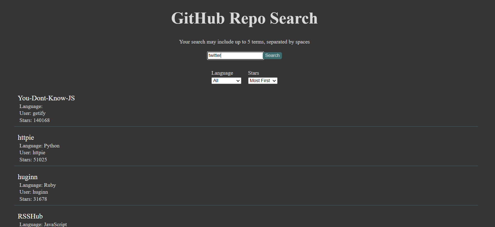

# GitHub Repo Search


## Description

GitHub Repo Search allows a user to utilize the GitHub api to search for various repos

### _Visit the website by clicking here_
[GitHub Repo Search](https://tniles320.github.io/github-repo-search/)



## Table of Contents 

* [Installation](#installation)

* [Usage](#usage)

* [License](#license)

* [Contribution Guidelines](#contribution-guidelines)

* [Tests](#tests)

* [Questions](#questions)

## Installation

Run the following command to install dependencies:

```
npm install
```

## Usage

After installation, run npm start. The application will run on localhost:3000 in your browser and searches can be performed locally.

## License

This project is licensed under MIT

## Contribution Guidelines

Currently there are no contribution guidelines for this repo.

## Tests

Run the following command in the terminal to run tests:

```
no tests currently for this repo
```

## Questions

If you have any questions regarding this repo, you may contact me at tniles320@gmail.com. To see my other work, follow this link: [GitHub](https://github.com/tniles320/).
